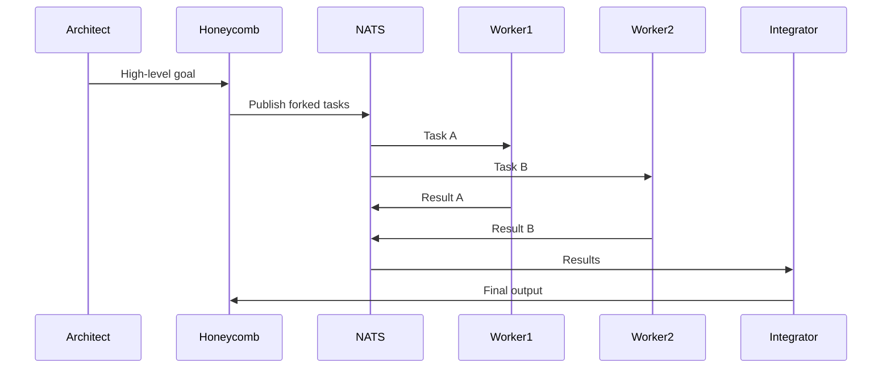
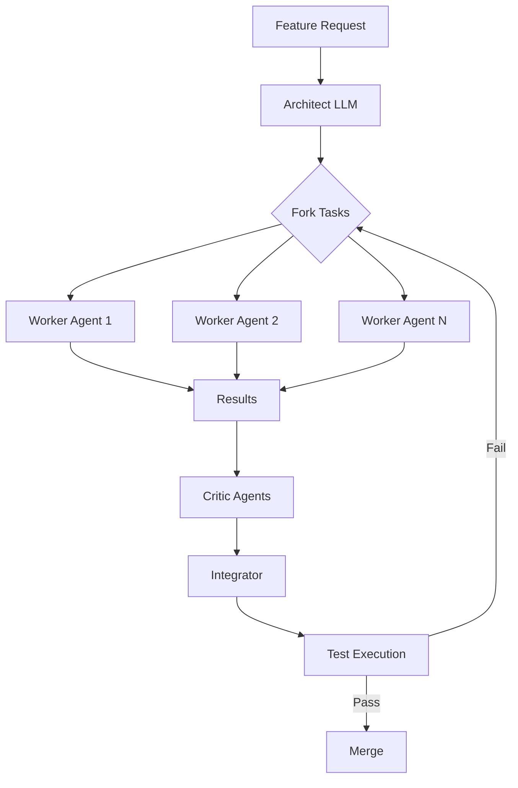

# Hive Manifesto

## 1. What Hive Is

Hive is **not a distributed LLM runtime**.
Hive is a **distributed cognition and execution fabric** for autonomous agents.

Hive exists to orchestrate *thinking*, not matrix multiplications.

Its core purpose is to:

* Decompose complex goals into parallelizable work
* Execute reasoning and execution **in parallel** across heterogeneous devices
* Re-compose results into coherent, validated outcomes
* Do this cheaply, fault-tolerantly, and without centralizing intelligence

Hive treats Large Language Models as *components*, not as the system itself.

---

## 2. The Core Abstraction Shift

### ❌ What Hive Is NOT

Hive explicitly rejects:

| Rejected Idea                          | Why It Fails                         |
| -------------------------------------- | ------------------------------------ |
| Splitting LLM layers across machines   | Transformers are sequential by layer |
| Sharding attention heads over networks | Cross-node latency dominates         |
| Sending activations/tensors over Wi‑Fi | Network jitter breaks determinism    |
| Token-by-token RPC inference           | Serialization kills throughput       |
| Turning phones into GPU clusters       | Physics > orchestration              |

These approaches fail on first principles:

* Tokens are generated sequentially
* Layers depend on previous layers
* Consumer networks are slow and unreliable

No amount of clever orchestration beats this reality.

---

### ✅ What Hive IS

Hive distributes **uncertainty, exploration, and work**, not computation graphs.

The atomic unit in Hive is:

> **Agent = Model + Memory + Tools + Policy**

Agents:

* Think independently
* Fail independently
* Communicate via messages
* Are cheap, replaceable, and disposable

Hive scales by running **many partial minds in parallel**, then reconciling them.

---

## 3. Fork–Join Cognition Model

Hive is built around a **fork–join execution primitive**.

### 3.1 Fork

A high-level goal is decomposed into independent subtasks.

**Example (Developer Task):**

> “Add distributed tracing to Honeycomb.”

Forks into:

* Investigate OpenTelemetry options
* Design trace propagation schema
* Implement NATS instrumentation
* Update Beekeeper UI
* Write tests

Each subtask is independently schedulable.

---

### 3.2 Parallel Execution

Each agent:

* Receives a narrow, explicit task
* Operates in isolation
* Has bounded context
* Does not synchronize during reasoning

There is:

* ❌ No shared token stream
* ❌ No shared memory
* ❌ No mid-task coordination

This removes coupling and enables scale.

---

### 3.3 Join

Results are:

* Collected
* Ranked
* Validated
* Merged

A **synthesizer / integrator agent**:

* Resolves conflicts
* Discards weak results
* Produces a coherent output

This mirrors real engineering teams:

> One architect → many contributors → one integrator

---

## 4. LLMs: Hard Constraints and Reality

### 4.1 Why LLM Inference Is Not Distributable (Casually)

Transformers execute as:

Embedding → Layer₁ → Layer₂ → … → Layerₙ → Output

Implications:

| Property          | Consequence                  |
| ----------------- | ---------------------------- |
| Sequential layers | No arbitrary sharding        |
| Token dependency  | No parallel token generation |
| Large activations | Network transfer too slow    |

---

### 4.2 Known Parallelism Strategies (and Why Hive Doesn’t Center on Them)

| Strategy             | Works When           | Why Hive Avoids It       |
| -------------------- | -------------------- | ------------------------ |
| Tensor Parallelism   | NVLink GPU clusters  | Requires expensive infra |
| Pipeline Parallelism | Long batch inference | High latency bubbles     |
| Data Parallelism     | High throughput      | No single-task speedup   |

These are **infrastructure optimizations**, not autonomy primitives.

---

### 4.3 What Explicitly Does NOT Work

Hive rejects:

* Splitting layers across phones
* Sending tensors over NATS
* Treating inference as MapReduce
* Microservice-per-layer architectures

These fail due to:

* Latency
* Jitter
* Synchronization overhead
* Fragility

---

## 5. The Correct Role of Consumer Devices

Phones, laptops, and PCs are **not mini GPUs**.

They are:

| Role      | Why It Fits                    |
| --------- | ------------------------------ |
| Explorers | Parallel hypothesis generation |
| Critics   | Independent validation         |
| Testers   | Cheap, redundant execution     |
| Scouts    | Environmental observation      |

They excel at:

* Small models (≤3B, INT4/INT8)
* Symbolic reasoning
* Tool execution
* Verification

They must **never**:

* Host partial SOTA model layers
* Exchange activations

---

## 6. Speculative Cognition (Agent-Level Parallelism)

Hive applies *speculation* at the **agent level**, not token level.

| Traditional Speculative Decoding | Hive Speculative Cognition |
| -------------------------------- | -------------------------- |
| One model predicts tokens        | Many agents predict ideas  |
| Token-level validation           | Result-level validation    |
| Single stream                    | Many independent streams   |

Agents propose:

* Plans
* Code
* Tests
* Arguments
* Counterexamples

A stronger agent verifies and integrates.

---

## 7. Three-Tier Execution Model

### Tier 1 — Edge Agents

| Property    | Value           |
| ----------- | --------------- |
| Devices     | Phones, laptops |
| Models      | ≤3B             |
| Reliability | Opportunistic   |
| Cost        | Free            |

Responsibilities:

* Decomposition
* Speculation
* Monitoring

---

### Tier 2 — Worker Agents

| Property    | Value                  |
| ----------- | ---------------------- |
| Devices     | Desktops, dev machines |
| Models      | 7B–14B                 |
| Reliability | Medium                 |
| Cost        | Low                    |

Responsibilities:

* Code generation
* Testing
* Simulation

---

### Tier 3 — Core Agents

| Property    | Value              |
| ----------- | ------------------ |
| Devices     | GPU servers / APIs |
| Models      | SOTA               |
| Reliability | High               |
| Cost        | High               |

Responsibilities:

* Architecture
* Arbitration
* Final synthesis

Hive minimizes calls to this tier.

---

## 8. Central Brain: Local or External

Hive supports interchangeable **architect brains**.

| Mode                        | Pros             | Cons          |
| --------------------------- | ---------------- | ------------- |
| Local GPU (Qwen)            | Control, privacy | Hardware cost |
| User API (ChatGPT / Claude) | Zero infra       | Rate limits   |

Hive treats APIs as **external brains**, not dependencies.

---

## 9. Messaging: Why NATS Exists

NATS is Hive’s **nervous system**.

| Capability    | Why It Matters     |
| ------------- | ------------------ |
| Pub/Sub       | Task fan-out       |
| Request/Reply | Coordination       |
| Low latency   | Real-time agents   |
| Lightweight   | Edge compatibility |

Without a message bus, Hive collapses into polling and coupling.

---

## 10. WebAssembly: Why It Exists

Wasm is **not for SOTA inference**.

It exists to:

| Purpose        | Reason          |
| -------------- | --------------- |
| Portability    | Run everywhere  |
| Sandboxing     | Security        |
| Hot deployment | Fast iteration  |
| Determinism    | Reproducibility |

Wasm agents:

* Receive tasks
* Execute logic or small models
* Call tools or APIs
* Return structured results

Hive never ships giant model weights in Wasm.

---

## 11. Developer Agents and Self-Building

Hive must build Hive.

### Fork–Join Developer Loop (Concrete)

1. Architect agent decomposes a feature
2. Hive forks tasks via NATS
3. Worker agents implement in parallel
4. Critics review outputs
5. Integrator merges results
6. Tests validate correctness

Failures trigger new forks.

---

## 12. Expected Improvements (Honest Numbers)

Hive does **not** promise:

* Faster single-token latency
* Cheaper raw inference

Hive delivers:

| Metric            | Expected Gain    |
| ----------------- | ---------------- |
| Task throughput   | 2–5×             |
| Parallel coverage | Near-linear      |
| LLM API usage     | Strong reduction |

This comes from reducing serial reasoning.

---

## 13. What Hive Competes With

| System    | Focus            | Difference                        |
| --------- | ---------------- | --------------------------------- |
| AutoGPT   | Prompt loops     | Hive is system-level              |
| LangChain | Prompt wiring    | Hive orchestrates agents          |
| CrewAI    | Role-play agents | Hive enforces execution semantics |

Hive is infrastructure, not UX.

---

## 14. Final Principle

> Do not distribute computation.
> Distribute uncertainty and exploration.

LLMs are serial thinkers.
Hive turns them into parallel societies.

This is Hive.

---

## 15. Qwen and SOTA Models: How They Actually Fit

Hive discussions explicitly considered **Qwen-class models (7B–72B)** and similar SOTA open models.

### 15.1 The Temptation: Splitting Qwen Across Devices

A recurring idea is:

> “Can we split Qwen inference across phones, laptops, and PCs to get more throughput?”

Hive’s answer is **no — and here is why, concretely**.

| Idea                              | Reality                                  |
| --------------------------------- | ---------------------------------------- |
| Split Qwen layers across machines | Each layer depends on previous output    |
| Distribute attention heads        | Requires ultra-low-latency interconnects |
| Stream activations via network    | Bandwidth + latency dominate compute     |
| Use consumer devices as shards    | Dropouts break inference                 |

Even for Qwen (which is efficient and well-optimized), this only works in:

* NVLink-connected GPUs
* InfiniBand clusters
* Controlled datacenter environments

It does **not** work over Wi-Fi, home networks, or mobile links.

---

### 15.2 What Qwen *Is* Used For in Hive

Qwen-class models are treated as **architect brains**, not distributed workers.

| Usage              | Description                       |
| ------------------ | --------------------------------- |
| Task decomposition | Break large goals into forks      |
| Arbitration        | Resolve conflicting agent outputs |
| Synthesis          | Merge parallel results            |
| Policy generation  | Define agent instructions         |

A single Qwen invocation can unlock **dozens or hundreds of parallel tasks** downstream.

This is the leverage point.

---

### 15.3 Centralized Does Not Mean Always-On

Hive does **not** assume:

* A permanently running Qwen GPU
* A single global brain

Instead:

| Mode                 | Behavior                          |
| -------------------- | --------------------------------- |
| On-demand local Qwen | Spin up GPU only when needed      |
| Burst reasoning      | Short, expensive reasoning phases |
| Cold idle            | Zero cost when inactive           |

Hive optimizes for **short, high-value calls**.

---

## 16. Detailed Control-Plane vs Compute-Plane Responsibilities

| Dimension      | Control Plane (Honeycomb) | Compute Plane (Agents) |
| -------------- | ------------------------- | ---------------------- |
| Task lifecycle | Owns                      | Executes               |
| Scheduling     | Owns                      | Reports capabilities   |
| State          | Centralized               | Ephemeral              |
| Fault handling | Retries / re-forks        | Fail fast              |
| Intelligence   | Minimal                   | Task-specific          |

The control plane is intentionally **dumb but authoritative**.

---

## 17. Message Flow Examples (Concrete)

### 17.1 Fork–Join via NATS (Mermaid)

---

### 17.2 Developer-Agent Self-Build Loop (Mermaid)

---

## 18. Throughput vs Latency: The Explicit Tradeoff

Hive optimizes for **throughput**, not latency.

| Dimension               | Central LLM | Hive        |
| ----------------------- | ----------- | ----------- |
| Single response latency | Lower       | Higher      |
| Total work completed    | Limited     | Much higher |
| Cost per task           | High        | Lower       |
| Failure isolation       | Poor        | Strong      |

Hive wins on **complex, multi-step problems**.

---

## 19. Why Hive Can Reduce Dependence on ChatGPT / Claude

Hive does **not eliminate** SOTA models.

It **changes how often you need them**.

| Without Hive                | With Hive                       |
| --------------------------- | ------------------------------- |
| One big LLM does everything | One LLM coordinates many agents |
| Serial reasoning            | Parallel exploration            |
| High token usage            | Minimal high-value calls        |

Result:

* You can run with **free-tier APIs**
* Or with **sporadic local GPU access**

---

## 20. Final Restatement (Non-Negotiable)

Hive will never:

* Split Qwen across consumer devices
* Stream tensors over networks
* Depend on always-on SOTA GPUs

Hive will always:

* Use SOTA models as architects
* Push work to cheap parallel agents
* Optimize for throughput, not latency

> Centralized brains. Distributed work. Collective intelligence.

---

## Non-Goals (Explicit Exclusions)

Hive is intentionally **not** many things. These exclusions are architectural guardrails.

Hive will **never** attempt to be:

* A distributed LLM inference engine
* A peer-to-peer token-level model sharding system
* An AutoGPT-style autonomous runaway agent loop
* A LangChain-style prompt orchestration framework
* A chatbot platform or conversational UI
* A workflow engine (Airflow, Temporal, Dagster, etc.)
* A replacement for SOTA LLM providers

If a feature proposal moves Hive closer to any of the above, it is out of scope by definition.

---

## Trust Model & Security Assumptions

Hive operates under an **adversarial-by-default** assumption.

* Agents are untrusted by default
* Agents may fail, hallucinate, lie, or disappear
* Agent outputs are *beliefs*, not facts
* No single agent output is authoritative

Security principles:

* The control plane never executes arbitrary agent code directly
* Wasm provides *containment*, not trust
* Side effects must be explicitly requested and approved
* Verification and critic agents are mandatory for high-stakes actions

Hive assumes failure is normal and designs for recovery, not prevention.

---

## Economic Invariant

Hive minimizes **expensive cognition** and maximizes **cheap speculation**.

This invariant governs all architectural decisions.

| Resource             | Strategy                       |
| -------------------- | ------------------------------ |
| SOTA LLM calls       | Rare, centralized, high-value  |
| Small / local models | Many, parallel, speculative    |
| GPUs                 | Bursty, not always-on          |
| Mobile devices       | Opportunistic contributors     |
| Human attention      | Reserved for final arbitration |

Hive is designed to scale *ideas*, not costs.

---

## Why NATS (and not "any queue")

Hive uses NATS as its primary agent communication substrate because:

* Agents communicate via **events**, not RPC
* Fire-and-forget semantics are acceptable
* At-most-once delivery is sufficient
* Agents are ephemeral and disposable
* Backpressure is a feature, not a bug

Hive explicitly rejects request/response coupling between agents. Cognition is asynchronous by nature.

---

## Correctness, Evaluation, and Convergence

Hive does not guarantee correctness.

Hive increases the *probability* of good outcomes by:

* Exploring many hypotheses in parallel
* Applying selective pressure via critics and integrators
* Centralizing judgment at well-defined synchronization points

This model mirrors scientific discovery, not deterministic computation.

Failure is a signal, not an error.

---

## Core Philosophy

**Speculate Everywhere. Decide Once.**

Hive enables massive parallel speculation across heterogeneous agents while preserving a single locus of judgment and commitment.

Distributed cognition. Centralized judgment.

---

*This document is frozen as MANIFESTO.md v1.0. Changes require explicit architectural justification.*
